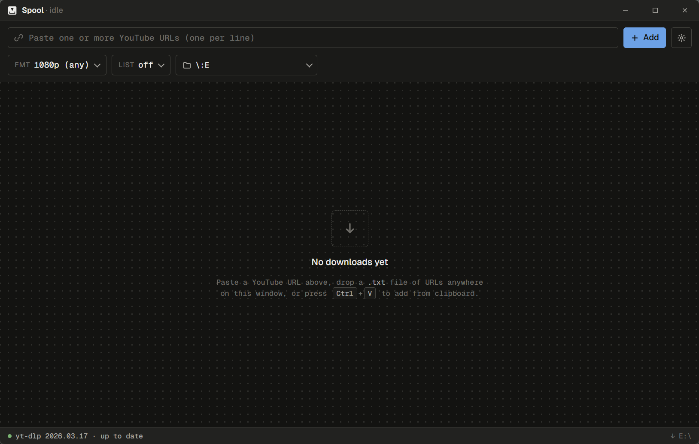

<div align="center">


# Spool

**Portable YouTube downloader for Windows.**

[Download latest](https://github.com/ratatabananana-bit/Spool/releases/latest) · [Issues](https://github.com/ratatabananana-bit/Spool/issues)



</div>

---

A small wrapper around `yt-dlp` with a queue, playlist guardrails, and the formats most people actually want. One folder. No install. Move it anywhere.

## What it does

| Feature | Details |
|---|---|
| Video up to 4K | 2160p · 1440p · 1080p · 720p · 480p — any container, or pick MP4 / WebM. |
| Audio | MP3 · M4A · Opus · WAV · FLAC, extracted with ffmpeg. |
| Queue | Multi-URL paste, configurable concurrency, per-job progress + log panel. |
| Playlist guardrails | Default treats `&list=...` as a single video so YouTube share links don't snowball into 200-video downloads. Switch to *Ask* or *All* when you want it. |
| Self-updating engine | `yt-dlp` runs `-U` on every launch. |
| Languages | English + 繁體中文. |
| Theme | Dark · light · system. |
| yt-dlp options | Subtitles, SponsorBlock, embed thumbnail / metadata / chapters, cookies-from-browser, rate limit, retries, passthrough args. |
| Portable | Settings live in `settings.json` next to the exe. Nothing in the registry, nothing in AppData. |

## Download

1. Grab `Spool-vX.Y.Z-portable-win-x64.zip` from [Releases](https://github.com/ratatabananana-bit/Spool/releases/latest).
2. Extract.
3. Run `Spool.exe`.

That's it. ~190 MB on disk (mostly `ffmpeg.exe` + `yt-dlp.exe`).

## Requirements

- Windows 10 / 11
- [WebView2 Runtime](https://developer.microsoft.com/microsoft-edge/webview2/) — preinstalled on Win11

## Build from source

```powershell
git clone https://github.com/ratatabananana-bit/Spool.git
cd Spool

# fetch yt-dlp + ffmpeg + ffprobe (gitignored, ~190 MB)
powershell -ExecutionPolicy Bypass -File scripts\fetch-binaries.ps1

# release build
tauri build --no-bundle
# → src-tauri/target/release/Spool.exe
```

You'll need Rust (`rustup` MSVC toolchain), Node.js, VS 2022 Build Tools (C++ workload), and `npm i -g @tauri-apps/cli`.

## Repo layout

```
src-tauri/        Rust + Tauri 2
  src/            jobs · settings · updater · debug log
  icons/          source.png is the Tray icon
  binaries/       sidecars — gitignored, fetched by script
ui/               vanilla HTML / CSS / JS (~5 KB JS gzipped target)
  fonts/          bundled Geist + Geist Mono
  locales.js      en + zh-Hant
assets/           icon + screenshots for this README
scripts/          dev helpers
```

## Credits

- **[yt-dlp](https://github.com/yt-dlp/yt-dlp)** — Unlicense
- **[ffmpeg](https://ffmpeg.org)** — essentials build by [gyan.dev](https://www.gyan.dev/ffmpeg/builds/), LGPL/GPL
- **[Tauri](https://tauri.app)** — Apache-2.0 / MIT
- **[Geist](https://vercel.com/font/geist)** — SIL OFL 1.1

## License

MIT — see [LICENSE](LICENSE).
